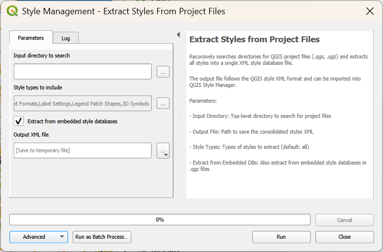

# MQS
My QGIS Stuff - A random assortment of things I might reuse. These might be images, styles, scripts or just documentation.

---

## Support

These are my resources that I make freely available to the world. You can ask me for help using them, but I may not be able to provide it due to knowledge or time constraints. 

Have a look at my [blog post](https://johnzastrow.github.io/2025-10-01-qgis-tutorial-materials/) for some more usefulness

---

## Scripts

Lately I'm doing work using python scripts to be used the in the [QGIS Toolbox](https://docs.qgis.org/3.40/en/docs/user_manual/processing/toolbox.html). You can use these scripts by downloading them, then importing them into your toolbox as following

1. Open your QGIS Toolbox
2. Select `Add script to toolbox` from the little python button

3. Double clicking the script name from the toolbox will run it and open the associated dialog screen 

---

## Repository Structure

This repository contains multiple QGIS-related subprojects:

---

### Subprojects

---

#### ExtractStylesfromDirectoriesForStyleManager
Location: `docs/ExtractStylesfromDirectoriesForStyleManager/`
Script: `Scripts/extract_styles_from_projects.py`

A QGIS Processing toolbox script that recursively searches directories for QGIS project files (.qgs, .qgz) and extracts all styles into a single XML file compatible with QGIS Style Manager. Use it to create a monster default set of reusable styles from all your hard work across your projects. This script uses tags based on the project names that it finds the styles in to help you organize them.

[!IMPORTANT]
This makes it really easy to create duplicates and otherwise pollute your global styles. It's easy to clean them up, but be prepared for housekeeping if you use this tool in anger.

**Features:**
- Extracts symbols, color ramps, text formats, label settings, and more
- Handles duplicate names automatically
- Tags styles with source project name
- Intelligent naming based on layer and symbol type
- Detailed progress feedback

See `docs/ExtractStylesfromDirectoriesForStyleManager/REQUIREMENTS.md` for detailed documentation.

---

#### vectors2gpkg
Location: `docs/vectors2gpkg/`
Script: `Scripts/vectors2gpkg.py`

A QGIS Processing Toolbox script that recursively searches directories for vector files and loads them into a single GeoPackage with metadata preservation and optional style application. Consolidates scattered vector data from complex directory structures into a modern, portable GeoPackage format.

**Features:**
- Supports 10 vector formats: shapefiles, GeoJSON, KML/KMZ, GPX, GML, GeoPackages, File Geodatabases, SpatiaLite, MapInfo, standalone dBase files
- Container format support: copies all layers from GeoPackages, File Geodatabases, and SpatiaLite databases
- Non-spatial table handling: loads attribute-only tables from container formats and standalone dBase files
- User-selectable file types with multi-select controls
- Spatial indexing and metadata preservation
- QML style file application
- Smart layer naming with invalid character replacement and duplicate collision handling
- Directory-aware layer naming with 5 configurable strategies (filename only, parent directory, smart path detection, etc.)
- Dry run mode to preview layer names before processing data
- Automatic duplicate resolution with incrementing numbers (roads, roads_1, roads_2, etc.)

See `docs/vectors2gpkg/README.md` for detailed documentation.

---

#### rasters2gpkg ⚠️ ABANDONED
Location: `docs/rasters2gpkg/`
Script: `Scripts/rasters2gpkg.py`

**This subproject has been abandoned due to GeoPackage specification limitations for analytical raster data.**

The GeoPackage raster storage specification is designed for tile-based base layers (web mapping), not analytical datasets requiring lossless compression, high bit-depths, and continuous data access. For analytical raster workflows, keep native formats (GeoTIFF, NetCDF, HDF) that are optimized for scientific analysis.

~~A QGIS Processing Toolbox script that recursively searches directories for raster files and loads them into a single GeoPackage with metadata preservation and optional style application. Consolidates scattered raster data from complex directory structures into a modern, portable GeoPackage format.~~

See `docs/rasters2gpkg/README.md` for detailed explanation of abandonment reasons and alternative approaches.

---

#### batchvectorrename
Location: `docs/batchvectorrename/`
Script: `Scripts/batchvectorrename.py`

A QGIS Processing Toolbox script that allows safe and efficient batch renaming of layers in vector files and databases that support layer renaming. Perfect for standardizing layer naming conventions, adding organizational prefixes/suffixes, and cleaning up messy layer names.

**Features:**
- Recursive directory scanning: automatically processes entire directory trees
- Multi-format vector file support: handles 9 different vector file formats
- Selective file type processing: user can choose which vector formats to process
- **9 rename operations**: Replace Text (find/replace with text removal), Trim Beginning, Trim End, Add Prefix, Add Suffix, Clean Names, Convert to Lowercase, Convert to Uppercase, Convert to Title Case
- Dry run mode to preview changes before applying them
- Automatic backup creation with timestamped filenames
- Automatic duplicate resolution: prevents conflicts with incremental numbering (_1, _2, _3)
- Name validation for database compatibility
- Atomic transactions with rollback capability for databases
- Comprehensive logging system using QgsMessageLog with Info, Warning, and Critical levels
- Progress reporting during file discovery and processing phases
- Enhanced error handling and recovery guidance

See `docs/batchvectorrename/README.md` for detailed documentation.

---

#### inventory_miner
Location: `docs/inventory_miner/`
Script: `Scripts/inventory_miner.py`

A QGIS Processing Toolbox script that recursively scans directories for all GDAL/OGR-supported geospatial files and creates a comprehensive spatial inventory stored in a GeoPackage database. Automatically discovers georeferenced data and creates extent polygons in EPSG:4326 for visualization. Perfect for cataloging large geospatial data collections and understanding your data holdings.

**Features:**
- **Automatic discovery**: Uses GDAL/OGR to find all georeferenced files (vectors, rasters, containers)
- **Georeference detection**: Recognizes coordinates in file headers, data bodies, and sidecar files (.prj, world files, .aux.xml)
- **GeoPackage output**: Creates spatial inventory layer with extent bounding box polygons in EPSG:4326
- **61+ metadata fields**: File system info, spatial metadata, vector/raster specifics, GIS metadata, quality indicators
- **Comprehensive metadata extraction**:
  - Vector: Geometry type, CRS, extent, feature count, field information, Z/M dimensions
  - Raster: Dimensions, band count, pixel size, data types, NoData values, compression
  - GIS metadata: Title, abstract, keywords, URL, ISO categories, contact info, links (from ISO 19115, FGDC, ESRI metadata)
- **Container format support**: Enumerates layers within GeoPackage, File Geodatabase, SpatiaLite databases
- **Non-spatial table detection**: Identifies attribute-only tables associated with spatial layers
- **Sidecar file tracking**: Reports presence of .prj, world files, .aux.xml, metadata .xml
- **Optional validation**: Thorough data integrity checking (reads actual features/pixels to verify data)
- **Extent transformation**: All extents transformed to EPSG:4326 for consistent visualization
- **Quality indicators**: Flags missing CRS, empty datasets, corrupted files, invalid geometries

See `docs/inventory_miner/README.md` for detailed documentation and usage examples.

---

#### metadata_manager ⚙️ IN DEVELOPMENT
Location: `docs/metadata_manager/`
Plugin: `Plugins/metadata_manager/`

A QGIS Plugin that helps users create, manage, and apply metadata to layers following QGIS and ISO 19115 standards. Features reusable metadata component libraries, guided workflow wizards, template system for bulk application, and integration with inventory databases to identify layers lacking metadata. Perfect for data managers who need to create comprehensive metadata for large geospatial data collections.

**Features:**
- **Guided metadata creation**: Step-by-step wizard for creating QGIS/ISO 19115 compliant metadata
- **Reusable libraries**: Store and reuse organizations, contacts, keywords, and templates
- **Template system**: Create templates for bulk metadata application across multiple layers
- **Inventory integration**: Connect to inventory GeoPackage (from inventory_miner) to identify layers needing metadata
- **Auto-population**: Pre-fill metadata from layer properties (CRS, extent, geometry type, etc.)
- **Validation**: Check metadata completeness and validate required fields
- **Batch processing**: Apply metadata templates to multiple layers from inventory
- **Export formats**: Export to QGIS XML, ISO 19115/19139 XML, and FGDC XML
- **Wizard and expert modes**: Choose between guided workflow or full-form interface
- **Metadata gap analysis**: Identify and prioritize layers missing metadata

**Installation** (QGIS Plugin - different from Processing scripts):
1. Copy `Plugins/metadata_manager` to your QGIS plugins folder:
   - Windows: `C:\Users\<username>\AppData\Roaming\QGIS\QGIS3\profiles\<profile>\python\plugins\`
   - Linux: `~/.local/share/QGIS/QGIS3/profiles/<profile>/python/plugins/`
   - macOS: `~/Library/Application Support/QGIS/QGIS3/profiles/<profile>/python/plugins/`
2. Compile resources: `cd metadata_manager && make` (or `pyrcc5 -o resources.py resources.qrc`)
3. Enable in QGIS: Plugins → Manage and Install Plugins → Enable "Metadata Manager"

**Current Status (v0.1.0)**: Plugin structure created with QGIS Plugin Builder. Core functionality implementation in progress.

See `docs/metadata_manager/README.md` for installation details and `docs/metadata_manager/REQUIREMENTS.md` for specifications.

---

#### Resources

Files that I might want to reuse and you might find useful

1. **Resources\qgis_styles_for_style_manager.xml** - Some styles I might to reuse across my QGIS installs, compiled using `extract_styles_from_projects.py`. I'll be adding to these.

---

#### Scripts

Python scripts for the QGIS Processing Toolbox. These correspond to most subprojects listed above. Development files for these scripts are in the `docs/` directory. Just grab scripts from this directory and add to QGIS Processing Toolbox.

1. **Scripts\extract_styles_from_projects.py** - see ExtractStylesfromDirectoriesForStyleManager above
2. **Scripts\vectors2gpkg.py** - see vectors2gpkg above
3. **Scripts\rasters2gpkg.py** - ⚠️ ABANDONED - see rasters2gpkg above for explanation
4. **Scripts\batchvectorrename.py** - see batchvectorrename above
5. **Scripts\inventory_miner.py** - see inventory_miner above

---

#### Plugins

QGIS Plugins (installed differently from Processing scripts). Copy entire plugin directory to your QGIS plugins folder, compile resources, then enable in QGIS Plugin Manager.

1. **Plugins\metadata_manager** - ⚙️ IN DEVELOPMENT - see metadata_manager above for installation instructions
